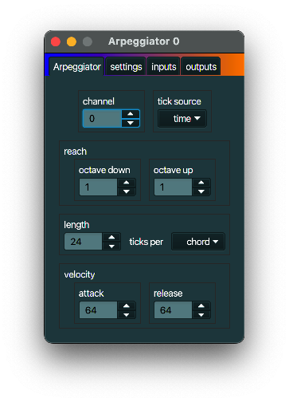

+++
archetype = "default"
title = "Arpeggiator"
+++

## description
An *Arpeggiator* plays notes of a chord individually in a progressive rising or descending order.

## typical use case
Arpeggiators are used in music creation to create a stream of notes, based on chords and
often spanning multiple octaves.

## example
Create a *MIDI device link* and link it to the Gervill software synth. Link your MIDI
keyboard to your computer. Create a *MIDI device link* and link it to your keyboard. Create an 
*Arpeggiator* and let it get its input from the MIDI keyboard and send its output to
MIDI device link that is linked to the Gervill synth. PLay a chord on your MIDI keyboard. You will
hear the chord notes arpeggiated.

