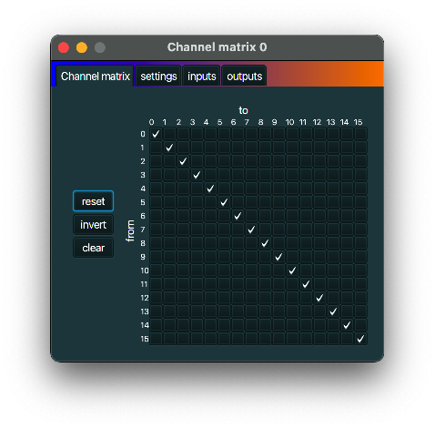

+++
archetype = "default"
title = "Channel matrix"
+++

## description
A *Channel matrix* can redirect all MIDI messages from zero or more MIDI input channels to zero or
more output channels.

## typical use case
If you want to redirect all MIDI messages coming in on channel 0 to instead be send to channel 1
(or to both channel 1 and channel 2), you can use a *Channel matrix*.

