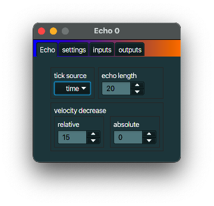

+++
archetype = "default"
title = "Echo"
+++

## description
An *Echo* can replay notes after a specified delay and with a softer velocity.

## notes
The time between echoed notes is a certain period. That period can be defined relative to the actual
time defined by the (computer) clock, or it can be defined by the number of MIDI clock messages. To
use the latter you must make sure that such MIDI clock messages are actually received by this
*MidiInOut*, for instance by adding a [MIDI clock](../midi_clock/) upstream.

## typical use case
I hope you can fill this one yourself.

## example
Connect an *Echo* to the *outputs* of a *Keyboard MIDI keyboard* to have an echo-like effect on the
notes played. Note the 'echo-like', because most synths will only play one note of a certain sound
and the same pitch at a time, instead of overlapping those with different velocities.