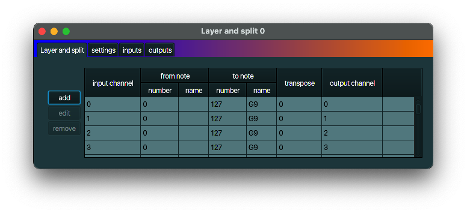

+++
archetype = "default"
title = "Layer and split"
+++

## description
A *Layer and split* can map ranges of keys of one channel to other ranges and channels,
while optionally transposing those keys up or down. You have the availability over a virtually
unlimited number of zones. Zones can overlap as well.

## typical use case
If you have an external MIDI keyboard without build-in splitting functionality, you can use a
*Layer and split* to send keys from one part of your keyboard to one synthesizer and
from another part to another synthesizer. Or you can send different ranges of keys to different
channels of a multitimbral synthesizer.

## example
Link a Roland JV-1080 to your computer. On the JV-1080 setup a base sound on MIDI channel 0 and a
solo instrument on channel 1. Create a *MIDI device link* and link it to the JV-1080. Link your MIDI
keyboard to your computer. Create a *MIDI device link* and link it to your keyboard. Create a
*Layer and split* and let it get its input from the MIDI keyboard and send its output to
the JV-1080. Create a layer in the *Layer and split* for the keys below C4 and specify
channel 0. Create a layer for key C4 and all keys above, and set it up to send to channel 1. If you
now press C3 on your MIDI keyboard, you will hear a base sound coming from the JV-1080. If you press
C4, you will hear the solo instrument.
