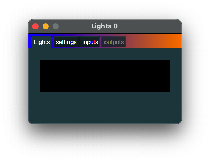

+++
archetype = "default"
title = "Lights"
+++

## description
A *Lights* displays MIDI information in a frivolous way. Currently only playing notes are displayed.
A higher velocity yields a brighter colour. Note that this MidiInOut part has no output, only input.

## typical use case
Use for diagnostic purposes to see if MIDI messages are flowing where you would expect them.

## example
A *Lights* can typically be used for diagnostic purposes.
