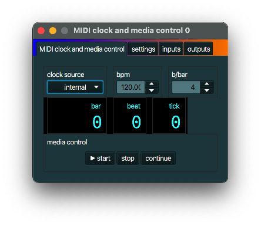

+++
archetype = "default"
title = "MIDI clock"
+++

## description
A *MIDI clock* generates MIDI *timing messages* at intervals as specified by as beats-per-minute
(BPM) setting, as well as *start*, *stop* and *continue* messages.

## typical use case
Use a *MIDI clock* to create MIDI clock messages (0xF8 or 248) for use by e.g. [Echo](../echo/) and
[Arpeggiator](../arpeggiator/).

## example
See *typical use case* above.

