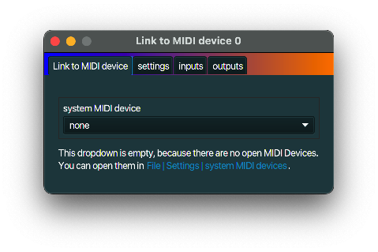

+++
archetype = "default"
title = "MIDI device link"
+++

## description
A *MIDI device link* is a MidiInOut part that acts as a bridge between other MidiInOut parts and
other MIDI software and hardware devices. All MIDI drivers that have been selected in **File | 
Settings | system MIDI devices** in the main **m.nlcode.nl** application window can be linked to.

## typical use case
External hardware devices can be used via a *MIDI device link*.

## example
Connect a MIDI keyboard to your computer. Enable its driver in **File | 
Settings | system MIDI devices**. Create a *MIDI device link* and select the MIDI keyboard driver
from its dropdown. The messages generated by the external keyboard can now be used in **m.nlcode.nl**
by other MidiInOut parts.

