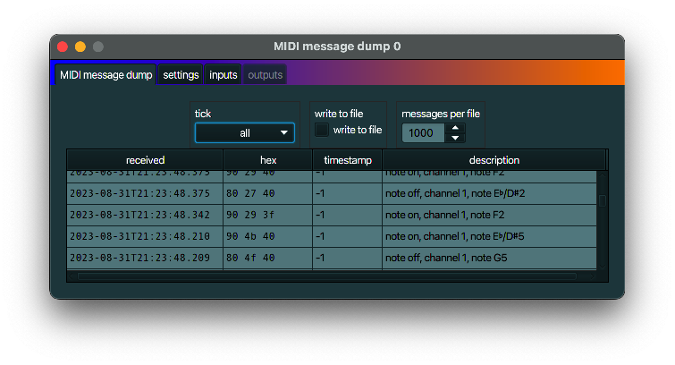

+++
archetype = "default"
title = "MIDI message dump"
+++

## description
A *MIDI message dump* is a MidiInOut part that displays all (or most) of all incoming MIDI messages.
When you set the *write to file* option, all new incoming messages will be written to file. The
file(s) can be found in the same directoy as the project file.
Note that this MidiInOut part has no output, only input.

## typical use case
A *MIDI message dump* is typically used for diagnostic purposes.

## example
Link a *MIDI message dump* to the *outputs* of a [MIDI device link](../midi_device_link/) that is
linked to an external MIDI device to see which messages are send from that external device.
