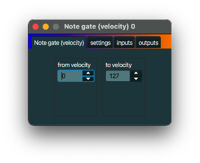

+++
archetype = "default"
title = "Note gate (velocity)"
+++

## description
A *Note gate (velocity)* acts as a gate in that it only sends out notes within certain velocity boundaries.
So basically you use a *Note gate* as a filter for notes that are too 'soft' or too 'loud'.

## typical use case
Filtering notes based on their velocity.

## example
No inspiration, sorry.

