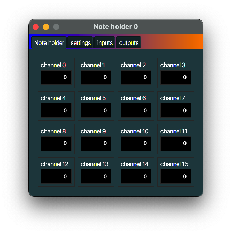

+++
archetype = "default"
title = "Note holder"
+++

## description
A *Note holder* hold notes until those notes are played again. So instead of using a sustain pedal,
you can use a *Note holder* to keep a note playing after a *note off* message.
A *Note holder* can be handy when used together with an [Arpeggiator](../arpeggiator/) MidiInOut part.

## typical use case
Connect an [Arpeggiator](../arpeggiator/) to the output of a *Note holder* to let the *Arpeggiator*
arpeggiate, while you have two hands free.

## example
See *typical use case* above.
