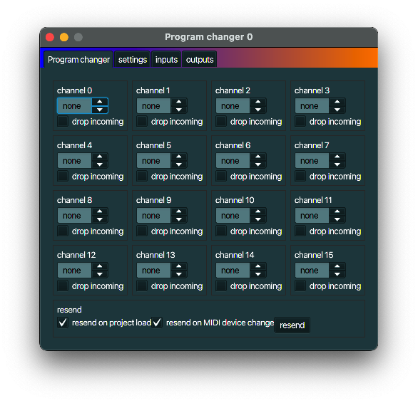

+++
archetype = "default"
title = "Program changer"
+++

## description
A *Program changer* can select different patches, instruments, whatever you like to call it.

## typical use case
Change the sounds that a synthesizer produces by changing the program.

## example
Connect the **outputs** of a *Program changer* to the **inputs** of a
[MIDI device link](../midi_device_link/) that is linked to a synthesizer. Play a note, select a
different program, and play the same note again. You hear a different sound.
