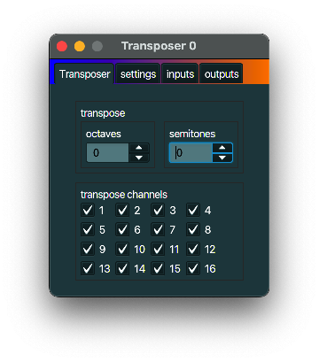

+++
archetype = "default"
title = "Transposer"
+++

## description
A *Transposer* transposes all note on and note off messages. It tries to be smart with note off messages if you changed the transpose height in between a note on and a note off.

## typical use case
Generate sounds in the same key as that annoying guitarist is playing in, while playing the keys on your keyboard in a key you feel comfortable in.

## example
Connect the **outputs** of a *Transposer* to the **inputs** of a
[MIDI device link](../midi_device_link/) that is linked to a synthesizer. Connect the **inputs** of a *Transposer* to the **outputs** of a *Keyboard MIDI Keyboard*. Play a note, set the *Transposer* to transpose a semitone up, and play the same note again. You hear the sound a semitone higher.
